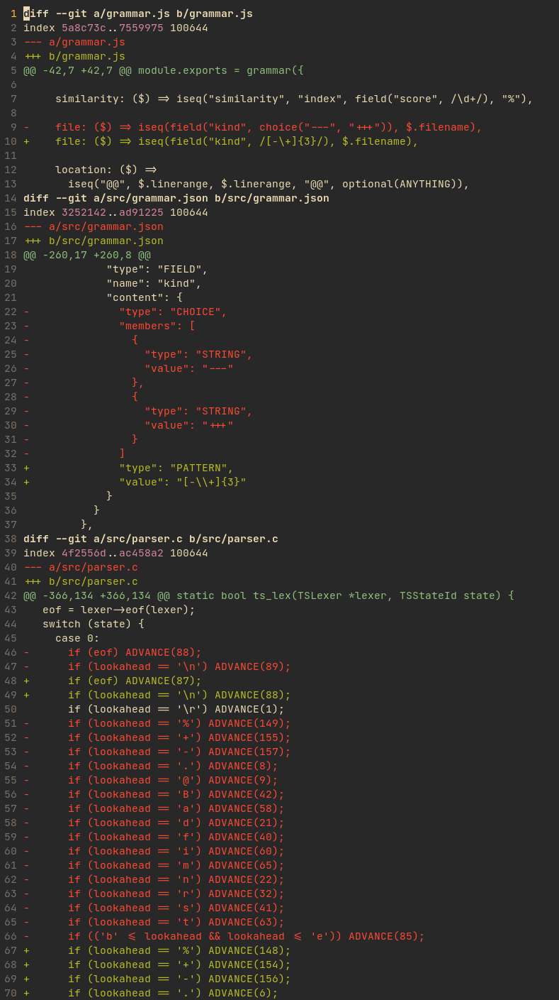
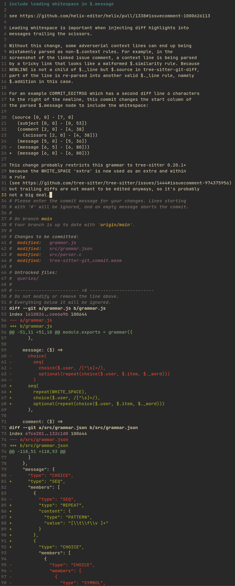

# `tree-sitter-git-diff`

A [tree-sitter](https://tree-sitter.github.io/tree-sitter/) grammar for `git diff`s.

### Status

Working, but needs more testing.

### Examples

Highlighting a `.diff` file:

Injecting this grammar into [tree-sitter-git-commit](https://github.com/the-mikedavis/tree-sitter-git-commit) in a verbose commit (`git commit --verbose`):

