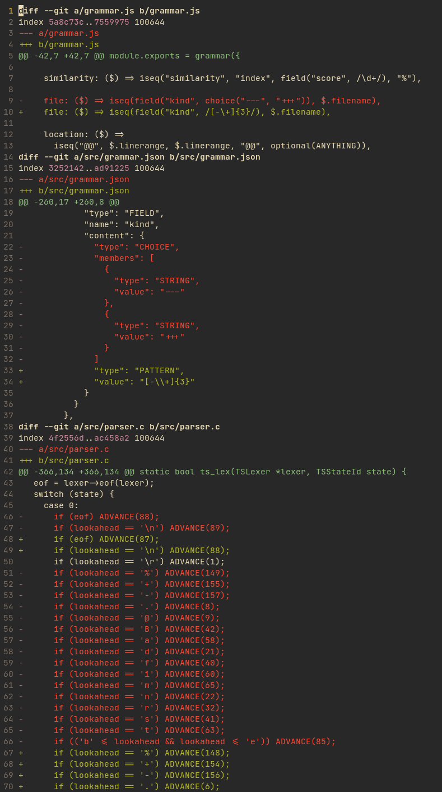
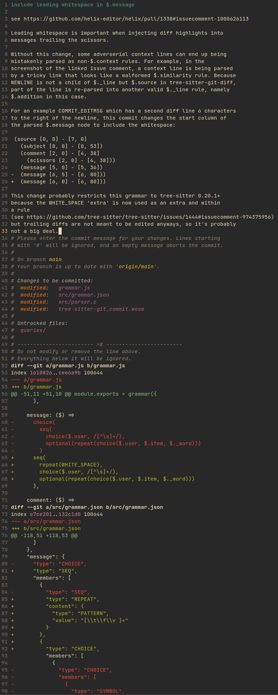

# `tree-sitter-diff`

[![CI][ci-badge]][ci-workflow]

A [tree-sitter][tree-sitter] grammar for [git unified `diff`s](https://git-scm.com/docs/git-diff#generate_patch_text_with_p)

Highlighting a `.diff` file:

Injecting this grammar into [tree-sitter-git-commit][tree-sitter-git-commit]
in a verbose commit (`git commit --verbose`):

[ci-badge]: https://github.com/the-mikedavis/tree-sitter-diff/actions/workflows/ci.yml/badge.svg
[ci-workflow]: https://github.com/the-mikedavis/tree-sitter-diff/actions/workflows/ci.yml
[tree-sitter]: https://tree-sitter.github.io/tree-sitter/
[tree-sitter-git-commit]: https://github.com/the-mikedavis/tree-sitter-git-commit
